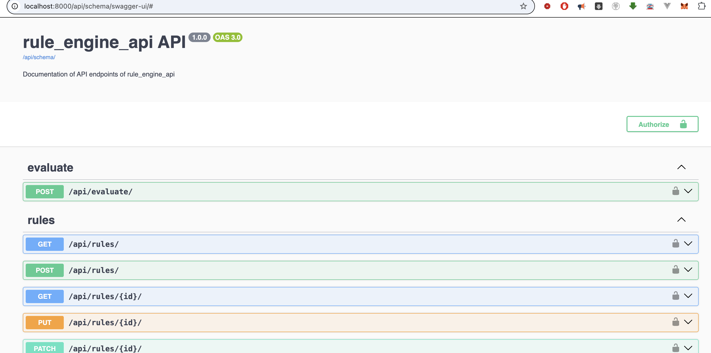

# rule_engine_api

Isara Institute exam

# Problem
https://hackmd.io/@XLqVAZxbRrKVLB9lj_k6TQ/rJ7Jgt_1gx

# Demo async call
1. `docker compose -f docker-compose.local.yml up`. In one terminal.
2. `docker ps -a`. To list all container ID. Looking for `locall_django` name.
3. `docker exec -it 647e4cc793ef /bin/bash`. Jump into container.
3. `export DATABASE_URL="postgres://${POSTGRES_USER}:${POSTGRES_PASSWORD}@${POSTGRES_HOST}:${POSTGRES_PORT}/${POSTGRES_DB}"
export CELERY_BROKER_URL="redis://redis:6379"`. Re-export again it is Docker bug.
4. `python manage.py shell_plus`. To to `shell_plus`
5. input
```
condition = {
   ...:   "field": "age",
   ...:   "operator": ">=",
   ...:   "value": 18
   ...: }
payload = {"age": 20}
from rule_engine_api.users.tasks import async_evaluate_condition
async_evaluate_condition.delay(condition, payload)
```
1. Check the `worker` terminal. The answer is `True`.
```bash
rule_engine_api_local_celeryworker  | INFO 2025-07-03 11:18:46,644 strategy 50 281472981590048 Task rule_engine_api.users.tasks.async_evaluate_condition[55b4ff4a-b3f8-4bd5-8c51-64067094864b] received
rule_engine_api_local_celeryworker  | INFO 2025-07-03 11:18:46,647 trace 58 281472981590048 Task rule_engine_api.users.tasks.async_evaluate_condition[55b4ff4a-b3f8-4bd5-8c51-64067094864b] succeeded in 0.0019144170000799932s: True
```

# Django Test
1. Jump into the `local_django` container as above.
2. ` python manage.py test`. To run testcases.

# Running the project
1. `docker compose -f docker-compose.local.yml run django python maange.py migrate`
2. `docker compose -f docker-compose.local.yml down`
3. `docker compose -f docker-compose.local.yml up`. Wait until all containers are ready.

# Browse the Swagger-UI
1. After run the project browse `http://localhost:8000/api/schema/swagger-ui/#`


# Remarks
- This project has used ChatGPT to evaluate the logic. However, the author of this project rearrange and make decision by himself.
